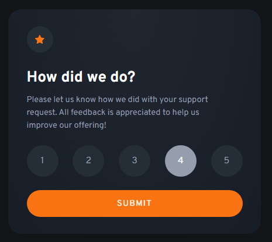

# Frontend Mentor - Interactive rating component solution

This is a solution to the [Interactive rating component challenge on Frontend Mentor](https://www.frontendmentor.io/challenges/interactive-rating-component-koxpeBUmI).

## Table of contents

- [Overview](#overview)
  - [The challenge](#the-challenge)
  - [Screenshot](#screenshot)
  - [Links](#links)
- [My process](#my-process)
  - [Built with](#built-with)
  - [What I learned](#what-i-learned)

## Overview

### The challenge

Users should be able to:

- View the optimal layout for the app depending on their device's screen size
- See hover states for all interactive elements on the page
- Select and submit a number rating
- See the "Thank you" card state after submitting a rating

### Screenshot




### Links

- Solution URL: [Solution](https://www.frontendmentor.io/solutions/interactive-rating-component-with-flexbox-and-vanilla-js-OPGYJcCs39)
- Live Site URL: [Live Site](https://soft-syrniki-db3863.netlify.app/)

## My process

### Built with

- Semantic HTML5 markup
- CSS custom properties
- Flexbox
- Vanilla JS

### What I learned

How to change the background of a selected/clicked button in JS

```js
ratingButtons.forEach((button) =>
	button.addEventListener('click', (e) => {
		selectedRating = button.textContent;
		ratingChoice.textContent = selectedRating;

		e.target.style.background = 'hsl(217, 12%, 63%)';
		e.target.style.color = 'hsl(0, 0%, 100%)';

		if (clickedButton !== null) {
			clickedButton.style.background = 'hsl(213, 19%, 18%)';
		}

		clickedButton = e.target;
	})
);
```
